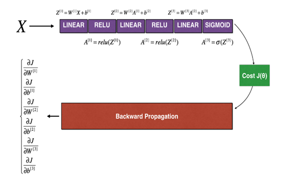

# Gradient Checking for Neural Networks

This is a small but really important project I worked on as part of my Deep Learning Specialization coursework. The focus here was to **implement gradient checking from scratch**, which is a crucial debugging step in training neural networks.

Gradient checking helps ensure that **backpropagation** is correctly implemented, by comparing it to a **numerical approximation of the gradient**. This saved me from chasing invisible bugs during training!

---

## 🔍 What’s Inside?

This project is broken down into 4 exercises, and here's a quick summary of each one:

### ✅ Exercise 1: `forward_propagation`
- Simple function to calculate:  
  `J(θ) = θ · x`
- This was the foundation for testing gradient computations.
<!-- Optional visual -->
<!--  -->

### 🔁 Exercise 2: `backward_propagation`
- Calculated the derivative of the above equation with respect to θ.
- Turned out to be:  
  `dJ/dθ = x`
<!-- Optional visual -->
<!--  -->

### 🧪 Exercise 3: `gradient_check`
- Implemented **1D gradient checking**.
- Compared:
  - Gradient from `backward_propagation`
  - Gradient approximation using:  
    `(J(θ + ε) - J(θ - ε)) / (2ε)`
- If the relative difference was small enough (typically `< 1e-7`), it confirmed our gradients were correct.
<!-- Optional visual -->
<!--  -->

### 🧠 Exercise 4: `gradient_check_n`
- Scaled things up to **N-dimensional parameters** like in a real neural network.
- Flattened parameters and gradients to vectors, then computed numerical gradient for **each** parameter.
- Compared the entire gradient vector from backprop with its numerical approximation.
- This was where the "real" test began. 😅

---

## 🖼️ Visuals That Helped Me A LOT

Here are a couple of diagrams that really clarified what’s going on under the hood:

### 1️⃣ Backpropagation through a 3-layer neural net

This shows the forward pass through layers (Linear → ReLU → Linear → ReLU → Linear → Sigmoid), followed by cost computation, and finally backward propagation where gradients are calculated for every weight and bias.

 <!-- Replace with actual image file path -->

### 2️⃣ Parameter Vectorization for Gradient Checking

This one shows how the dictionary of parameters (`W1`, `b1`, ..., `W3`, `b3`) is converted into a single vector using `dictionary_to_vector()` and back using `vector_to_dictionary()`.

This step is necessary to calculate and compare gradients during the numerical check.

 <!-- Replace with actual image file path -->

## 🧰 Tools & Concepts Used

- **NumPy** for numerical operations.
- **Forward and Backward Propagation** logic.
- **Gradient Approximation** using finite differences.
- **Norm-based difference checking**:  
  `difference = ||grad - gradapprox||₂ / (||grad||₂ + ||gradapprox||₂)`
<!-- Optional visual -->
<!--  -->

---

## 🤯 What I Learned

- Even small mistakes in gradient computation can break a neural network. Gradient checking is like a "sanity check" to prevent that.
- Writing out `dictionary_to_vector` and `vector_to_dictionary` functions helped me deeply understand how neural networks manage their parameters behind the scenes.
- This exercise showed me the **power of math** in making code trustworthy.

---

## 📌 Notes

- I avoided using loops wherever possible and stuck to vectorized operations (except where instructed).
- The code is structured for clarity — each function is modular and testable.
- Hidden tests passed ✅ 🙌

---

## ✍️ Final Thoughts

This might look like a simple exercise, but it gave me a whole new appreciation for what's happening inside a neural net. I feel much more confident now about debugging deep learning models — not just guessing but **mathematically verifying** things.

If you’re diving into machine learning, I’d highly recommend going through this kind of hands-on gradient check implementation. It really cements the fundamentals. 🚀

---

Thanks for reading 🙌  
— Sagar Shahari 🧠💻
